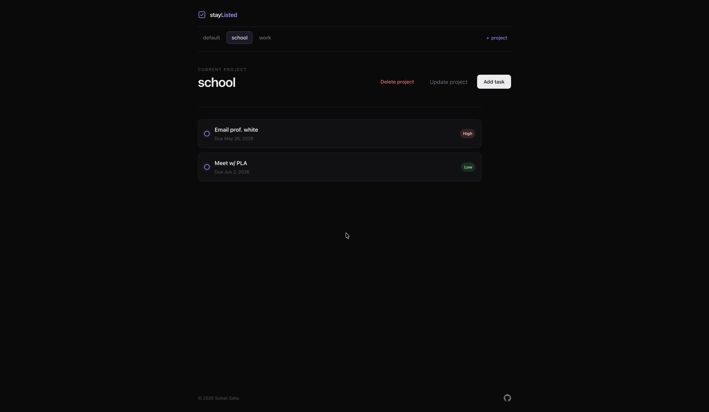

# stay<span style="color: #a78bfa;">Listed</span>

A browser todo app for organizing work across **projects**. Each project holds its own list of tasks: you can add todos with a title, description, due date, priority, optional notes, and an optional checklist, then expand a card to read details, edit, mark complete, or delete with confirmation.

There is no backend – everything runs in the browser and persists in **`localStorage`**, so your projects and todos survive a refresh. The UI is plain HTML and CSS with native **`<dialog>`** modals for create/update/delete flows, **`<details>`** cards for each todo, and a horizontal **project rail** at the top. Layout stays readable on different screen sizes thanks to a centered column, scrollable todo area, and a minimal dark theme (purple accent on black).

This was built as a learning / portfolio piece (thanks to **The Odin Project** community), with my own **stay<span style="color: #a78bfa;">Listed</span>** branding and styling. If you are reading the repo, you will see how **models**, **app state**, and **DOM updates** are kept in separate modules, how forms stash ids on submit, and how JSON from storage is turned back into class instances on load.

### What’s on `main` (current code)

The **default branch** uses **ES6 classes** for `Project`, `Todo`, and `ChecklistItem`, plus **IIFE-style modules**:

- **`AppController`** — holds projects, current project, default-project rules, and all mutations; calls `saveData` after changes and `loadAppData` on startup
- **`UiController`** — renders the project rail and todo cards, wires modals and delegated clicks, and calls into `AppController` (no direct `localStorage` in the UI layer)
- **`storage.js`** — thin `localStorage` helpers (`JSON.stringify` / `JSON.parse`)

The UI is bundled with **Webpack 5** (dev server, production build, GitHub Pages deploy). That is a step up from a single `index.html` script tag, but the app logic itself is still vanilla JavaScript — no React, Vue, or similar.

<p align="center">
  
</p>

#### Key engineering concepts used in this project

- **`Project`, `Todo`, `ChecklistItem` as ES6 classes** — each instance gets a stable `id` from `crypto.randomUUID()`; todos own a `checklist` array of `ChecklistItem` objects
- **IIFE modules** — `AppController` and `UiController` export a small public API without polluting the global scope
- **Separation of concerns** — data + persistence vs DOM + events; the UI rebuilds lists from state instead of patching individual nodes everywhere
- **Event delegation** — one listener on `.todo-list` for edit, delete, and complete clicks; project selection on the rail
- **Native `<dialog>`** — add/update project, add/update todo, and delete confirmations without a modal library
- **`<details>` / `<summary>`** — expandable todo cards; `preventDefault` on the check control so completing a task does not toggle the card open
- **`dataset.todoId` on forms** — bridges “click Edit on card” to “submit Update modal” when the submit event no longer has the card in the DOM
- **`localStorage`** — full `projects` tree saved as JSON; `loadAppData` reconstructs class instances (including checklist items) after parse
- **`date-fns`** — formats due dates in the todo card header (`MMM d, yyyy`)
- **Priority badges** — CSS modifiers for High / Medium / Low
- **Completed state** — `todo-card--completed` with purple strikethrough on the title

## Getting Started

### **Try it online**

**Live app:** [https://soikat27.github.io/stay-listed/](https://soikat27.github.io/stay-listed/) — opens in the browser; data is stored in your own browser’s `localStorage`.

### **Run it locally** (if you are cloning or tweaking the code)

You need **Node.js** and **npm** for the Webpack dev server and production build.

#### **Prerequisites**

- **Node.js** (LTS recommended) and **npm**
- **Git** (only if you use `git clone` below; otherwise use GitHub **Code → Download ZIP**)

#### Check that Git is installed (only if you clone)

```bash
git --version
```

#### **Installing**

##### 1. Clone this repository and open the project directory

```bash
git clone https://github.com/soikat27/stay-listed.git
```

```bash
cd stay-listed
```

##### 2. Install dependencies

```bash
npm install
```

#### **Running locally**

Start the development server (opens in the browser with hot reload):

```bash
npm run dev
```

#### **Production build**

```bash
npm run build
```

Built files are written to `dist/`. You can serve that folder with any static host or use `npm run deploy` for GitHub Pages.

## Using the app

The same behavior applies on the [live demo](https://soikat27.github.io/stay-listed/) and when you run the dev server locally.

### Features

- **Projects** — create new projects from the rail; switch between them with one click
- **Default project** — a built-in `default` project cannot be renamed or deleted (delete/update buttons are hidden when it is selected)
- **Todos** — title, description, due date, priority (Low / Medium / High), and optional notes
- **Checklists** — optional sub-tasks per todo (one item per line in the form); stored as `ChecklistItem` objects
- **Expandable cards** — click a todo summary to open description, notes, checklist, and actions
- **Complete** — click the circle on the left to toggle done; completed todos show a muted, strikethrough title
- **Edit** — opens a pre-filled modal; checklist lines are joined with newlines for editing
- **Delete** — confirmation modal before removing a todo
- **Delete project** — confirmation modal; removes the project and all its todos
- **Persistence** — every create/update/delete/complete writes to `localStorage` under the `projects` key

### Usage

- Use the **project rail** to pick the active project; **+ project** opens the new-project dialog
- **Add task** (header) opens the add-todo form for the **current** project
- Click a **todo card** to expand it; use **Edit todo** or **Delete todo** inside the expanded area
- Click the **check circle** on a todo (not the rest of the summary) to mark it complete or incomplete
- **Delete project** / **Update project** in the header apply to the current project (hidden on default)

### Upcoming features

- Toggle individual **checklist items** complete in the UI (model support exists; wiring is still TODO)
- Restore **expanded todo** across `updateDisplay()` without a full-card flicker (optional polish)
- Sort or filter todos (by due date, priority, complete vs active)
- Optional **export / import** of project data as JSON

## Available Scripts

- `npm run dev` — Webpack Dev Server with hot reload
- `npm run build` — production build into `dist/`
- `npm run deploy` — `npm run build` then publish `dist/` to the `gh-pages` branch via `gh-pages`

## Deployment

The deploy script runs:

```bash
npm run build && gh-pages -d dist
```

That builds the project, then publishes the generated `dist/` folder to GitHub Pages. This repo is set up for **https://soikat27.github.io/stay-listed/** — make sure `homepage` in `package.json` matches your repository name if you fork or rename.

You could also host the same `dist/` output on Netlify, Cloudflare Pages, or any static file host.

## Built with

- Plain **HTML**, **CSS**, and **JavaScript** (no UI framework)
- **Webpack 5** — `webpack.common.js`, `webpack.dev.js`, `webpack.prod.js`
- **HtmlWebpackPlugin** — builds from `src/template.html`
- **`date-fns`** — due date formatting in the todo list
- **ES6 classes** — `Project`, `Todo`, `ChecklistItem`
- **IIFE modules** — `AppController`, `UiController`, `storage.js`
- **`<dialog>`** — all create/update/delete modals
- **`<details>`** — expandable todo cards
- **`localStorage`** — client-side persistence
- **`crypto.randomUUID()`** — ids for projects, todos, and checklist items

## Contributing

Contributions are welcome and appreciated. Open an issue or send a PR if you want to add checklist toggles in the UI, tighten persistence edge cases, improve accessibility, or teach me something I missed.

## Author

- **Soikat Saha** — design and implementation

## License

This project is licensed under the MIT License — see the [LICENSE](LICENSE) file for details.

## Acknowledgments

- Shoutout to the **Odin Project** community and curriculum for the todo-list assignment and the push toward modular JS.
- Thanks to everyone who maintains solid **MDN** docs — `<dialog>`, `<details>`, and `Storage` got plenty of use.
- Built on my own **Webpack starter template**; kept the runtime vanilla on purpose so the module boundaries stay easy to follow in a portfolio read-through.
